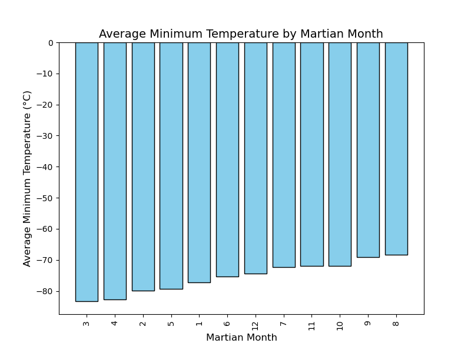
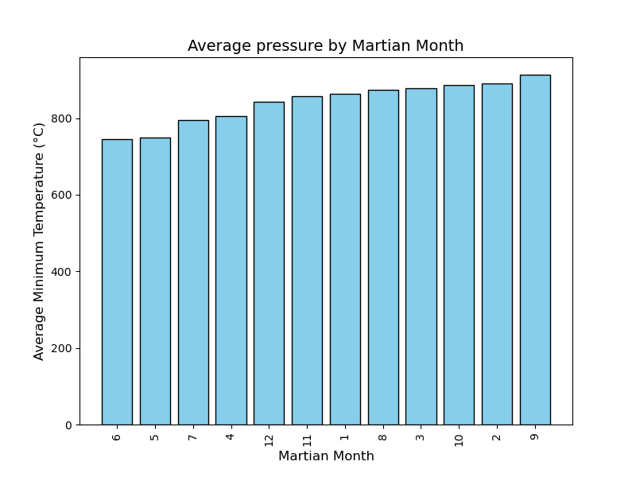
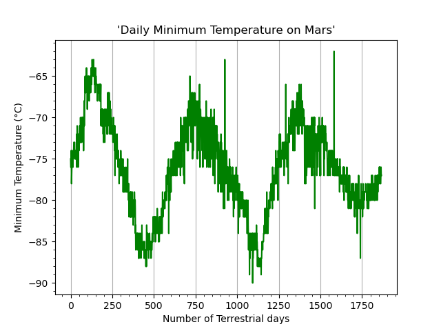

## Overview
This challenge involves scraping and analyzing data related to Mars. The analysis is divided into two sections:
1. **Mars News Scraper:** Extracts news articles and details (titlesand previews) from a provided Mars news website.
2. **Mars Weather Data Scraper and Analyzer:** Collects and analyzes Mars weather data, such as minimum temperatures and atmospheric pressures.

## Project Structure
- `part_1_mars_news.py`: Script to scrape and process Mars news articles.
- `part_2_mars_weather.py`: Script to scrape and analyze Mars weather data.
- `Resources/`: Directory containing saved CSV files for Mars news and weather data.
- `Images/`: Directory for saved visualization plots.

### Data Analysis
The Mars News Scraper collects and processes news articles related to Mars from a provided website. The Mars Weather Data Scraper collects weather data (such as temperatures and atmospheric pressures) from Mars and analyzes it for patterns and trends across Martian months.The analysis includes the following:
1. **How many months exist on Mars?**
   - There are 12 months on Mars, similar to Earth.

2. **How many Martian (and not Earth) days' worth of data exist?**
   - The dataset contains data for 1867 Martian days (sols).

3. **What are the coldest and warmest months on Mars?**
   The temperatures are very cold, ranging from around -83°C in the colder months to around -68°C in the warmer months.  
Month 3 appears to be the coldest with an average minimum temperature of -83.31°C, while Month 8 is the warmest with an average minimum temperature of -68.38°C.  
Martian winter occurs during months 2–3 (coldest months), and the Martian summer peaks in months 7–8 (warmer months).
     

4. **Which months have the lowest and highest atmospheric pressure?**
   The highest atmospheric pressure occurs in Month 9 (913.31), and the lowest pressure occurs in Month 6 (745.05 ).This data shows how the atmosphere changes over the course of a Martian year, with higher pressures during some months and lower pressures during others, likely due to seasonal variations in temperature, atmospheric conditions.

     

5. **How many terrestrial (Earth) days exist in a Martian year?**
   -From your visual estimate, you noted peak-to-peak and valley-to-valley differences of 662.5 days (e.g., 750 to 100, 1450 to 700 sols), with an average difference of 662.5 Earth days,which is very close to the actual 687 Earth days that define a Martian year.

     
### Conclusion:
The data analysis reveals significant insights into the Martian environment. From understanding the seasonal temperature fluctuations to examining pressure patterns, these findings help us build a more detailed picture of Mars' climate. The analysis of Mars' climate shows that the planet experiences a cold and harsh environment, with extreme temperature variations between its cold winters and relatively warm summers.The temperature range on Mars (from -83°C to -68°C) is far colder than Earth’s, and the pressure levels are much lower.
